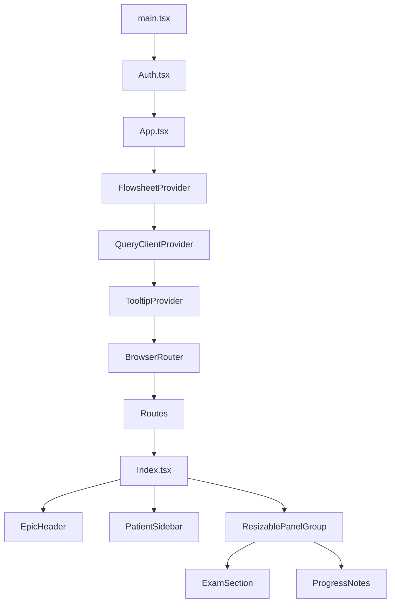
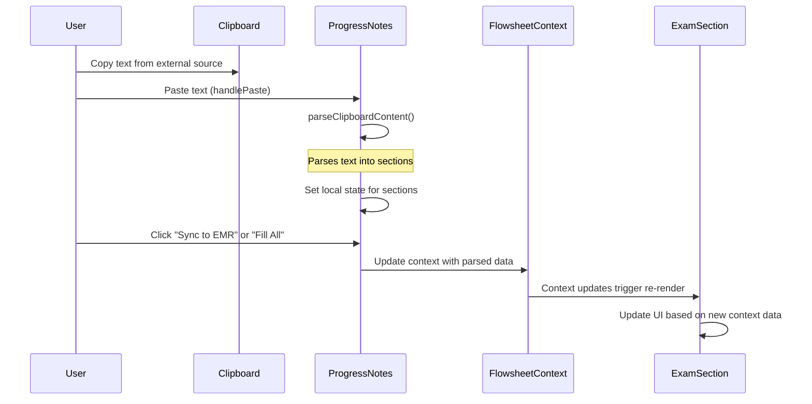
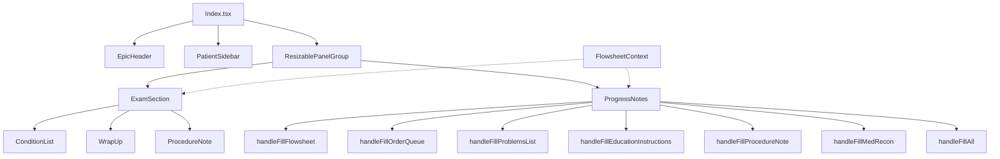
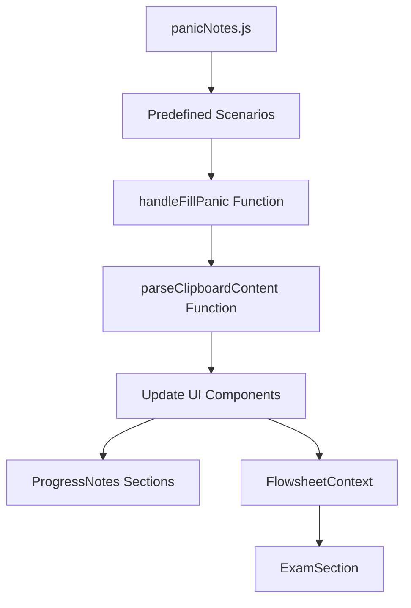
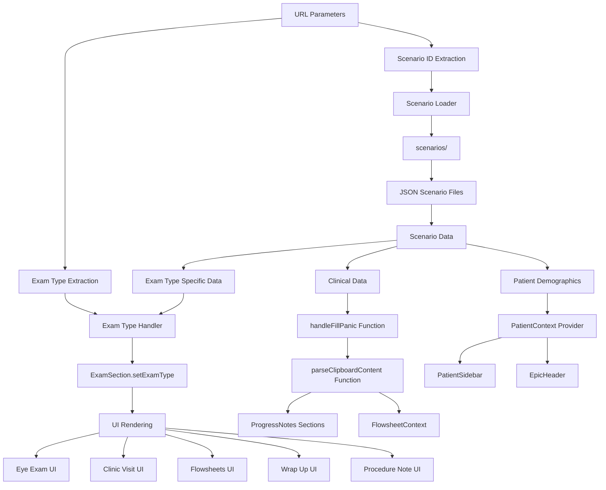

# EMR Demonstration Mockup Application - Architecture Analysis

## 1. Overall Application Structure

The EMR demonstration mockup is a React-based single-page application that simulates an Electronic Medical Record system. The application is structured as follows:



### Key Components:

1. **Auth.tsx**: Handles basic authentication using a password from environment variables.
2. **App.tsx**: Main application component that sets up providers and routing.
3. **FlowsheetProvider**: Context provider for managing shared state across components.
4. **Index.tsx**: Main page component that organizes the layout.
5. **EpicHeader.tsx**: Contains the header with patient name in tab and provider information.
6. **PatientSidebar.tsx**: Displays patient demographics and medical information.
7. **ExamSection.tsx**: Displays and manages examination data.
8. **ProgressNotes.tsx**: Handles progress notes and clipboard-to-EMR functionality.

## 2. Data Flow and Clipboard-to-EMR Functionality

The clipboard-to-EMR functionality is a central feature of the application, allowing users to paste content from an external source into the EMR system.



### Key Data Flow Processes:

1. **Clipboard to ProgressNotes**:
   - User pastes text into ProgressNotes component
   - `handlePaste()` captures the clipboard event
   - `parseClipboardContent()` processes the text and extracts structured data

2. **ProgressNotes to Context**:
   - User triggers sync via button click or keyboard shortcut (~)
   - Handler functions (`handleFillFlowsheet`, `handleFillOrderQueue`, etc.) update the FlowsheetContext
   - Data is now available to all components via context

3. **Context to ExamSection**:
   - ExamSection accesses the FlowsheetContext
   - UI updates to reflect the new data

## 3. Component Relationships

The application uses a combination of component hierarchy and context-based state management to establish relationships between components.



## 4. Current Panic Scenario Implementation

The application currently has a panic scenario feature that allows loading predefined clinical scenarios:



The panic scenarios are defined in `panicNotes.js` and include:
- History of Present Illness
- Physical Examination
- Results
- Assessment & Plan
- Attestation
- Flowsheet data (JSON)
- Orders list (JSON)
- Problems list (JSON)
- Education instructions
- Procedure notes
- Medication reconciliation

## 5. Patient Demographics and Page Elements

Currently, patient demographics and other page elements are hardcoded in the components:

1. **PatientSidebar.tsx**:
   - Patient name: "SFDPH Scribe"
   - Date of visit: "Demo | 04.22.2025"
   - Date of birth: "DOB: 04/15/1850"
   - Provider: "Dr. Marcus Commure"
   - Insurance: "Medicare"
   - And other patient-specific information

2. **EpicHeader.tsx**:
   - Patient name in tab: "TestPatient, Test"
   - Provider name: "MED PRACTICE PPMC - DAVID COMMONS"

## 6. URL Parameter-Based Scenario System

To implement a URL parameter-based scenario system that can also configure patient demographics and handle different exam types, we need to:



### Key Implementation Components:

1. **URL Parameter Handling**:
   - Extract scenario ID from URL parameters on application load
   - Support optional exam type parameter to switch to the appropriate view

2. **Scenario Data Management**:
   - Move from hardcoded panicNotes.js to JSON files in a scenarios directory
   - Structure scenario data to include clinical data, patient demographics, and UI configuration

3. **Patient Context Provider**:
   - Create a new context provider for patient demographics
   - Update PatientSidebar and EpicHeader to use this context

4. **Integration with Existing Functions**:
   - Leverage the existing `handleFillPanic` and `parseClipboardContent` functions
   - Trigger these functions automatically when a scenario ID is present in the URL

### Implementation Example:

```javascript
// Create a new PatientContext.tsx
import React, { createContext, useContext, useState, ReactNode } from "react";

interface PatientContextType {
  patientName: string;
  patientDOB: string;
  visitDate: string;
  providerName: string;
  interpreterNeeded: string;
  insurance: string;
  preferredLab: string;
  previousExam: string;
  nextVisit: string;
  // Add other patient demographics as needed
  setPatientData: (data: Partial<PatientContextType>) => void;
}

const PatientContext = createContext<PatientContextType | undefined>(undefined);

export const PatientProvider = ({ children }: { children: ReactNode }) => {
  const [patientName, setPatientName] = useState<string>("SFDPH Scribe");
  const [patientDOB, setPatientDOB] = useState<string>("04/15/1850");
  const [visitDate, setVisitDate] = useState<string>("04.22.2025");
  const [providerName, setProviderName] = useState<string>("Dr. Marcus Commure");
  const [interpreterNeeded, setInterpreterNeeded] = useState<string>("Sometimes");
  const [insurance, setInsurance] = useState<string>("Medicare");
  const [preferredLab, setPreferredLab] = useState<string>("Quest Diagnostics");
  const [previousExam, setPreviousExam] = useState<string>("3 months ago");
  const [nextVisit, setNextVisit] = useState<string>("6/27/2025");
  
  const setPatientData = (data: Partial<PatientContextType>) => {
    if (data.patientName) setPatientName(data.patientName);
    if (data.patientDOB) setPatientDOB(data.patientDOB);
    if (data.visitDate) setVisitDate(data.visitDate);
    if (data.providerName) setProviderName(data.providerName);
    if (data.interpreterNeeded) setInterpreterNeeded(data.interpreterNeeded);
    if (data.insurance) setInsurance(data.insurance);
    if (data.preferredLab) setPreferredLab(data.preferredLab);
    if (data.previousExam) setPreviousExam(data.previousExam);
    if (data.nextVisit) setNextVisit(data.nextVisit);
    // Update other fields as needed
  };

  return (
    <PatientContext.Provider 
      value={{ 
        patientName, 
        patientDOB, 
        visitDate, 
        providerName, 
        interpreterNeeded, 
        insurance, 
        preferredLab, 
        previousExam, 
        nextVisit, 
        setPatientData 
      }}
    >
      {children}
    </PatientContext.Provider>
  );
};

export const usePatient = (): PatientContextType => {
  const context = useContext(PatientContext);
  if (!context) {
    throw new Error("usePatient must be used within a PatientProvider");
  }
  return context;
};
```

### URL Parameter Handling for Exam Types

The application would support two key URL parameters:
1. `scenario`: Specifies which scenario to load
2. `examType`: Specifies which exam type to display

Example URLs:
- `/?scenario=pediatric-well-visit&examType=Clinic%20Visit`
- `/?scenario=eye-examination&examType=Eye%20Exam`
- `/?scenario=patient-flowsheet&examType=Flowsheets`

```javascript
// In App.tsx or Index.tsx
import { useEffect } from 'react';
import { useFlowsheet } from './AutoFillContexts';
import { usePatient } from './PatientContext';

// Function to load scenario data from JSON file
const loadScenarioData = async (scenarioId) => {
  try {
    const response = await fetch(`/scenarios/${scenarioId}.json`);
    if (!response.ok) {
      throw new Error(`Failed to load scenario: ${response.status}`);
    }
    return await response.json();
  } catch (error) {
    console.error('Error loading scenario:', error);
    return null;
  }
};

// In your component
const Index = () => {
  // Get the setExamType function from ExamSection
  // This would require lifting state up from ExamSection to Index
  // or using a context provider for exam type
  const [examType, setExamType] = useState("Clinic Visit");
  
  const { setFlowsheet, setOrdersList, setProblemsList, setEducationInstructions } = useFlowsheet();
  const { setPatientData } = usePatient();
  
  useEffect(() => {
    // Extract parameters from URL
    const urlParams = new URLSearchParams(window.location.search);
    const scenarioId = urlParams.get('scenario');
    const urlExamType = urlParams.get('examType');
    
    // Set exam type from URL if provided
    if (urlExamType && ["Clinic Visit", "Eye Exam", "Flowsheets", "Wrap Up", "Procedure Note"].includes(urlExamType)) {
      setExamType(urlExamType);
    }
    
    if (scenarioId) {
      // Load scenario data
      loadScenarioData(scenarioId).then(scenarioData => {
        if (scenarioData) {
          // If URL doesn't specify exam type but scenario does, use the scenario's exam type
          if (!urlExamType && scenarioData.examType) {
            setExamType(scenarioData.examType);
          }
          
          // Apply clinical data based on exam type
          if (scenarioData.clinicalData) {
            // Different exam types might need different data formats
            switch (examType) {
              case "Eye Exam":
                // Apply eye exam specific data
                if (scenarioData.clinicalData.eyeExam) {
                  // Set checked conditions for eye exam
                  if (scenarioData.clinicalData.eyeExam.checkedConditions) {
                    setCheckedConditions(scenarioData.clinicalData.eyeExam.checkedConditions);
                  }
                  
                  // Set slit lamp and fundus examination values
                  // This would require exposing these values from ExamSection
                }
                break;
                
              case "Flowsheets":
                // Apply flowsheet specific data
                if (scenarioData.clinicalData.flowsheets) {
                  // Set selected sections for flowsheets
                  if (scenarioData.clinicalData.flowsheets.selectedSections) {
                    setSelectedSections(scenarioData.clinicalData.flowsheets.selectedSections);
                  }
                }
                break;
                
              case "Wrap Up":
                // Apply wrap up specific data
                // This would require exposing state from WrapUp component
                break;
                
              case "Procedure Note":
                // Apply procedure note specific data
                // This would require exposing state from ProcedureNote component
                break;
            }
            
            // Create formatted data for clipboard parsing
            const formattedData = formatScenarioData(scenarioData.clinicalData, examType);
            
            // Use existing parseClipboardContent function or directly update context
            if (scenarioData.clinicalData.flowsheet) {
              setFlowsheet(JSON.stringify(scenarioData.clinicalData.flowsheet));
            }
            if (scenarioData.clinicalData.orders_list) {
              setOrdersList(JSON.stringify(scenarioData.clinicalData.orders_list));
            }
            // Set other clinical data as needed
          }
          
          // Apply patient demographics
          if (scenarioData.patientData) {
            setPatientData(scenarioData.patientData);
          }
        }
      });
    }
  }, []);
  
  // Pass examType and setExamType to ExamSection
  return (
    <div className="h-screen flex flex-col">
      <EpicHeader openScribe={openScribe} />
      
      <div className="flex flex-1">
        <PatientSidebar />
        <div className="epic-vertical-separator" />
        
        <ResizablePanelGroup direction="horizontal" className="flex-1">
          <ResizablePanel defaultSize={65} minSize={0}>
            <ExamSection examType={examType} setExamType={setExamType} />
          </ResizablePanel>
          <ResizableHandle className="w-1 bg-gray-200 hover:bg-gray-300 transition-colors" />
          <ResizablePanel defaultSize={35}>
            <ProgressNotes />
          </ResizablePanel>
        </ResizablePanelGroup>
      </div>
    </div>
  );
};

// Helper function to format scenario data based on exam type
const formatScenarioData = (clinicalData, examType) => {
  // Base format for all exam types
  let formatted = `History of Present Illness:
${clinicalData.historyOfPresentIllness || ''}

Physical Examination:
${clinicalData.physicalExamination || ''}

Results:
${clinicalData.results || ''}

Assessment & Plan:
${clinicalData.assessmentPlan || ''}

Attestation:
${clinicalData.attestation || ''}`;

  // Add exam type specific data
  switch (examType) {
    case "Eye Exam":
      formatted += `\n\neyeExam:
${JSON.stringify(clinicalData.eyeExam || {}, null, 2)}`;
      break;
      
    case "Flowsheets":
      formatted += `\n\nflowsheet:
${JSON.stringify(clinicalData.flowsheet || {}, null, 2)}`;
      break;
      
    case "Wrap Up":
      formatted += `\n\nwrapUp:
${JSON.stringify(clinicalData.wrapUp || {}, null, 2)}`;
      break;
      
    case "Procedure Note":
      formatted += `\n\nprocedureNote:
${JSON.stringify(clinicalData.procedureNote || {}, null, 2)}`;
      break;
  }
  
  // Add common data sections
  if (clinicalData.orders_list) {
    formatted += `\n\norders_list:
${JSON.stringify(clinicalData.orders_list, null, 2)}`;
  }
  
  if (clinicalData.problems_list) {
    formatted += `\n\nproblems_list:
${JSON.stringify(clinicalData.problems_list, null, 2)}`;
  }
  
  if (clinicalData.education_instructions) {
    formatted += `\n\neducation_instructions:
${clinicalData.education_instructions}`;
  }
  
  return formatted;
};
```

### JSON Scenario Structure with Exam Type Support

```json
{
  "id": "eye-examination",
  "name": "Comprehensive Eye Examination",
  "examType": "Eye Exam",
  "clinicalData": {
    "historyOfPresentIllness": "Patient presents with complaints of blurry vision at distance, worse in the right eye. Symptoms have been present for approximately 3 months and are most noticeable when driving at night.",
    "physicalExamination": "Visual Acuity:\nWithout correction: OD 20/100, OS 20/80\nWith correction: OD 20/40, OS 20/30\n\nSlit-Lamp Examination:\nLids: Normal\nConjunctiva/Sclera: Clear\nCornea: Clear OU\nAnterior Chamber: Deep and quiet OU\nIris: Normal OU\nLens: OD 2+ nuclear sclerotic cataract, OS 1+ nuclear sclerosis",
    "results": "Intraocular Pressure: OD 16 mmHg, OS 15 mmHg",
    "assessmentPlan": "Assessment:\n1. Nuclear Sclerotic Cataract, right eye > left eye\n2. Myopia\n\nPlan:\n1. Updated spectacle prescription provided\n2. Discussed cataract surgery options for the right eye\n3. Return in 6 months to reassess cataract progression",
    "attestation": "I have reviewed the documentation and agree with the content as written.",
    
    "eyeExam": {
      "checkedConditions": ["Edema", "Dystrophy"],
      "slitLamp": {
        "ll": {"right": "Normal", "left": "Normal"},
        "cs": {"right": "White and quiet", "left": "White and quiet"},
        "cornea": {"right": "Edema, Corneal dystrophy", "left": "Edema, Corneal dystrophy"},
        "ac": {"right": "Deep and quiet", "left": "Deep and quiet"},
        "iris": {"right": "Round and reactive", "left": "Round and reactive"},
        "lens": {"right": "+2 Nuclear sclerosis", "left": "+1 Nuclear sclerosis"},
        "vitreous": {"right": "Normal", "left": "Normal"}
      },
      "fundus": {
        "disc": {"right": "Normal", "left": "Normal"},
        "cdRatio": {"right": "0.3", "left": "0.3"},
        "macula": {"right": "Normal", "left": "Normal"},
        "vessels": {"right": "Normal", "left": "Normal"},
        "periph": {"right": "Normal", "left": "Normal"}
      }
    },
    
    "orders_list": {
      "orders": [
        "Updated spectacle prescription"
      ]
    }
  },
  "patientData": {
    "patientName": "Smith, Robert",
    "patientDOB": "05/12/1955",
    "visitDate": "04.23.2025",
    "providerName": "Dr. Marcus Commure",
    "interpreterNeeded": "No",
    "insurance": "Medicare",
    "preferredLab": "Quest Diagnostics",
    "previousExam": "1 year ago",
    "nextVisit": "10/23/2025"
  }
}
```

### Example: Flowsheets Scenario

```json
{
  "id": "pediatric-flowsheet",
  "name": "Pediatric Flowsheet",
  "examType": "Flowsheets",
  "clinicalData": {
    "historyOfPresentIllness": "Routine well-child visit for a 26-month-old patient.",
    "physicalExamination": "Temperature 98.6°F, Heart rate 100 bpm, Respiratory rate 24, Blood pressure 95/55 mmHg",
    "results": "No laboratory tests performed.",
    "assessmentPlan": "Healthy 26-month-old with normal development.",
    "attestation": "I have reviewed the documentation and agree with the content as written.",
    
    "flowsheet": {
      "patientAgeMonths": 26,
      "vitals": {
        "temperatureF": 98.6,
        "heartRateBpm": 100,
        "respiratoryRate": 24,
        "bloodPressure": "95/55"
      },
      "physicalDevelopment": {
        "running": "yes",
        "climbing": "yes",
        "appetite": "good"
      },
      "languageDevelopment": {
        "saysMultipleWords": "yes",
        "combinesTwoToThreeWords": "yes",
        "followsTwoStepInstructions": "yes"
      },
      "socialDevelopment": {
        "playsNearOtherChildren": "yes",
        "learningToShare": "yes"
      },
      "vision": {
        "visionScreening": "Normal"
      }
    },
    
    "flowsheets": {
      "selectedSections": ["vitals", "physicalDevelopment", "languageDevelopment", "socialDevelopment", "vision"]
    }
  },
  "patientData": {
    "patientName": "Johnson, Emily",
    "patientDOB": "02/15/2023",
    "visitDate": "04.23.2025",
    "providerName": "Dr. Sarah Miller",
    "interpreterNeeded": "No",
    "insurance": "Blue Cross",
    "preferredLab": "LabCorp",
    "previousExam": "6 months ago",
    "nextVisit": "10/23/2025"
  }
}
```

### Handling Multiple Exam Types in a Workflow

For scenarios that need to guide users through multiple exam types, the URL parameter approach can be extended to support a workflow:

1. **Initial Load**: Load the scenario with the first exam type
   ```
   /?scenario=comprehensive-visit&examType=Clinic%20Visit
   ```

2. **Transition to Next Exam Type**: When the user is ready to move to the next exam type, update the URL parameter
   ```javascript
   // Function to transition to the next exam type
   const transitionToNextExamType = (nextExamType) => {
     const urlParams = new URLSearchParams(window.location.search);
     urlParams.set('examType', nextExamType);
     
     // Update URL without reloading the page
     window.history.pushState(
       {}, 
       '', 
       `${window.location.pathname}?${urlParams.toString()}`
     );
     
     // Update the exam type in the UI
     setExamType(nextExamType);
   };
   
   // Example usage in a "Next" button
   <button onClick={() => transitionToNextExamType("Flowsheets")}>
     Continue to Flowsheets
   </button>
   ```

3. **Workflow Configuration**: Define the workflow in the scenario JSON
   ```json
   "workflow": {
     "steps": [
       {
         "examType": "Clinic Visit",
         "nextExamType": "Flowsheets",
         "buttonText": "Continue to Flowsheets"
       },
       {
         "examType": "Flowsheets",
         "nextExamType": "Wrap Up",
         "buttonText": "Continue to Wrap Up"
       },
       {
         "examType": "Wrap Up",
         "nextExamType": null,
         "buttonText": "Complete Visit"
       }
     ]
   }
   ```

4. **Workflow UI**: Add navigation buttons based on the workflow configuration
   ```javascript
   // In ExamSection component
   const renderWorkflowButtons = () => {
     if (!scenarioData || !scenarioData.workflow) return null;
     
     // Find the current step in the workflow
     const currentStep = scenarioData.workflow.steps.find(
       step => step.examType === examType
     );
     
     if (!currentStep || !currentStep.nextExamType) return null;
     
     return (
       <button 
         className="bg-blue-500 text-white px-4 py-2 rounded mt-4"
         onClick={() => transitionToNextExamType(currentStep.nextExamType)}
       >
         {currentStep.buttonText || `Continue to ${currentStep.nextExamType}`}
       </button>
     );
   };
   ```

## 7. Implementation Steps

To implement this architecture, follow these steps:

1. **Create the PatientContext Provider**:
   - Create a new file `src/PatientContext.tsx` with the context provider code
   - Add the provider to the component hierarchy in `App.tsx`

2. **Update Components to Use PatientContext**:
   - Modify `PatientSidebar.tsx` to use values from context instead of hardcoded values
   - Update `EpicHeader.tsx` to use patient name from context

3. **Create Scenario JSON Files**:
   - Create a `scenarios` directory in the public folder
   - Add JSON files for different scenarios (e.g., `eye-examination.json`, `pediatric-flowsheet.json`)

4. **Implement URL Parameter Handling**:
   - Add code to `Index.tsx` to extract and process URL parameters
   - Implement scenario loading logic

5. **Lift Exam Type State**:
   - Move the `examType` state from `ExamSection.tsx` to `Index.tsx`
   - Pass `examType` and `setExamType` as props to `ExamSection`

6. **Modify ExamSection for External Control**:
   - Update `ExamSection.tsx` to accept `examType` and `setExamType` as props
   - Expose methods to set exam-specific data (e.g., checked conditions, slit lamp values)

7. **Test with Different Scenarios**:
   - Create test URLs with different scenario IDs and exam types
   - Verify that the application loads the correct data and displays the appropriate UI

## 8. Conclusion

This architecture extends the existing panic scenario functionality to work with URL parameters while also making patient demographics and exam types configurable. The approach:

1. Maintains the core functionality of the application
2. Leverages existing code for parsing and applying clinical data
3. Adds a new layer for patient demographics
4. Supports loading scenarios from JSON files
5. Allows triggering scenarios via URL parameters
6. Provides flexibility for different exam types

This implementation provides a foundation that can be extended in the future to support more dynamic configuration of UI elements and workflows.